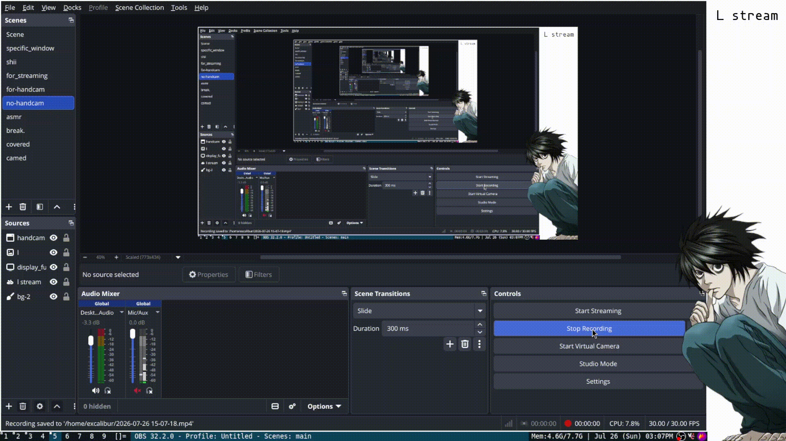

## Setup Pics:




### Requirements:
* DWM dependencies.
* picom.
* feh.
* rofi
* flameshot.
* tsoding/boomer(optional).
* dwmblocks(compile from folder).

> If you don't want boomer then you can just get rid of it
in dwm(config.def.h) line number 93 and 100.

### Warning:
> Use the installation scripts at your own risk. I never
tested it before, I had gemini make it for me. It is highly
recommended for you to install it manually or use the installation
scripts as guides instead.

### Manual installation:

Step 1: Build dwm and dwmblocks in their respective directory with
```txt
sudo make clean install

```

Step 2: Install this packages in your desired package manager
```txt
picom
feh
rofi
flameshot
tmux
alacritty
kitty (optional)
```

Step 3: Copy the config files
```txt
mkdir ~/Wallpaper
mkdir ~/.config/alacritty
mkdir ~/.config/kitty
mkdir ~/Wallpaper
cp .xinitrc ~/
cd config_files
cp .zshrc ~/
cp .tmux.conf ~/
cp L2.png ~/Wallpaper/
cp dwm.desktop /usr/share/xsessions/
cp alacritty.toml ~/.config/alacritty/
cp kitty.conf ~/.config/kitty/
cp johval-squared-l-theme.rasi ~/.local/share/rofi/themes/
cp lasts.sh ~/
cp shit.sh ~/
cp picom.conf ~/.config/picom/
cp -r FiraCode /usr/share/fonts/
touch ~/dirs

```
